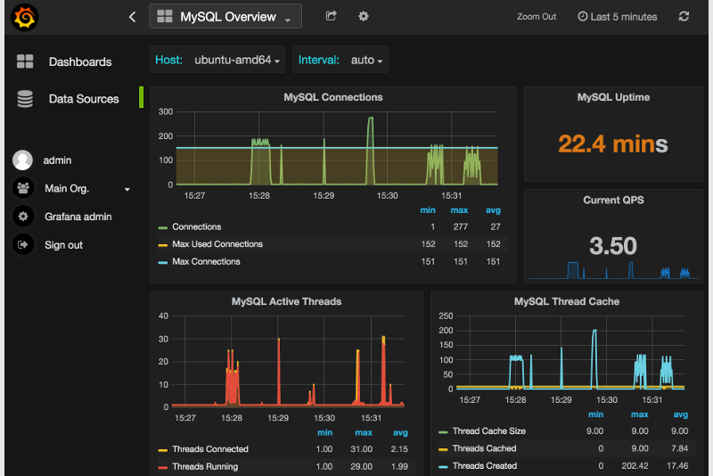
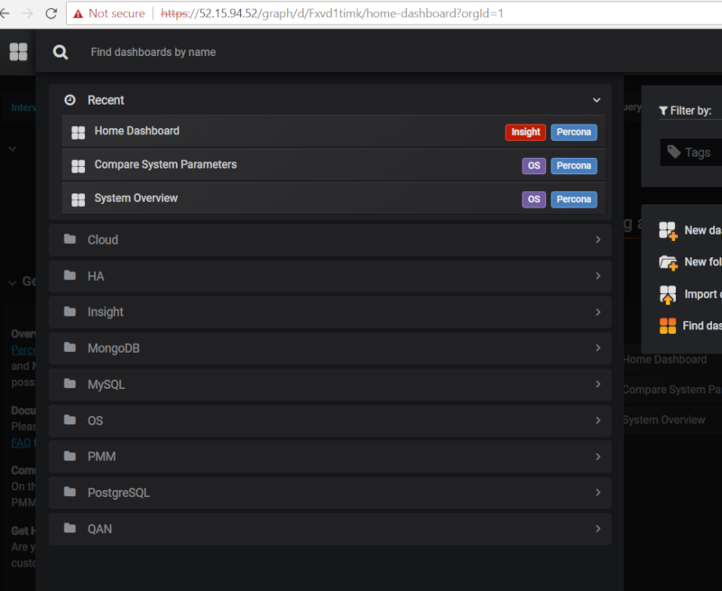
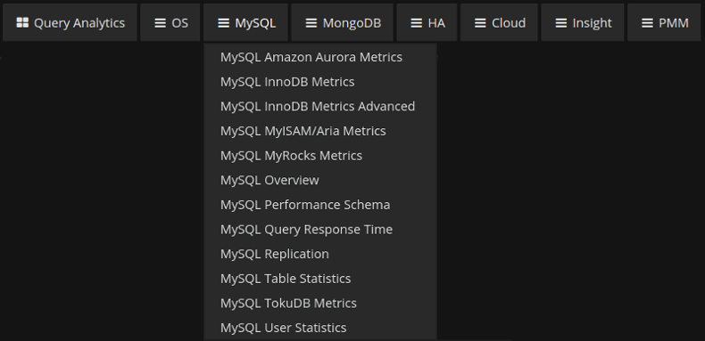
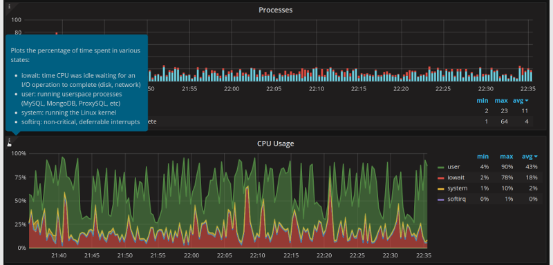
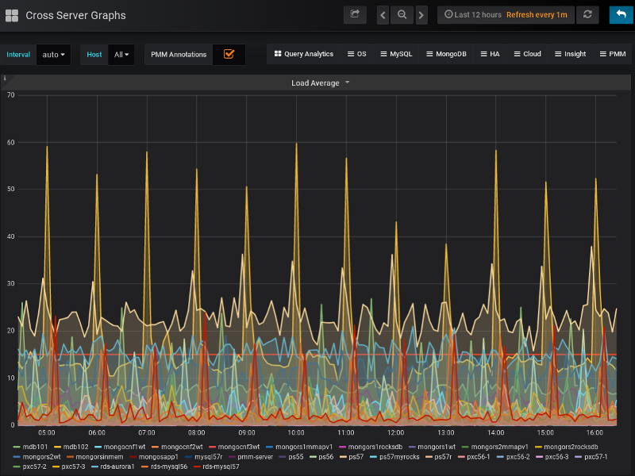
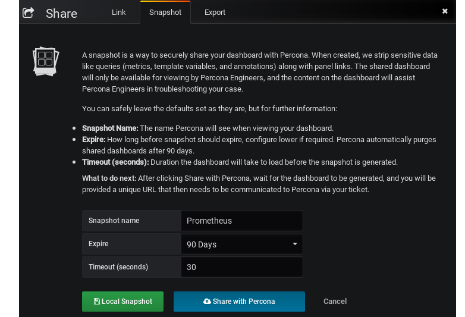

# Metrics Monitor

The Metrics Monitor tool provides a historical view of metrics that are critical to a database server. Time-based graphs are separated into dashboards by themes: some are related to MySQL or MongoDB, others provide general system metrics.

In this section

[TOC]

## Signing in

The credentials used to sign in to Grafana depend on the options that you specified when starting PMM Server:

* If you do not specify either `SERVER_USER` or `SERVER_PASSWORD`, you will log in as an anonymous user.  You can change to a different existing Grafana user.
* If you specify both `SERVER_USER` and `SERVER_PASSWORD`, then these credentials will be used to sign in to Grafana.
* If you specify only `SERVER_PASSWORD`, a single user (`pmm`) will be used to sign in to all components (including QAN, Prometheus, Grafana, etc.).  You will not be able to change to a different Grafana user.
* If you specify only `SERVER_USER`, this parameter will be ignored.

!!! alert alert-warning "Warning"
    The value of the `SERVER_USER` parameter may not contain the **#** or **:** symbols.

To access the dashboards, provide default user credentials:

* User: `admin`
* Password: `admin`

On the Home screen, select a dashboard from the list of available Percona dashboards.  For example, the following image shows the *MySQL Overview* dashboard:

## Opening a Dashboard

The default PMM installation provides more than thirty dashboards. To make it easier to reach a specific dashboard, the system offers two tools. The Dashboard Dropdown is a button in the header of any PMM page. It lists all dashboards, organized into folders. Right sub-panel allows to rearrange things, creating new folders and dragging dashboards into them. Also a text box on the top allows to search the required dashboard by typing.

You can also use a navigation menu which groups dashboards by application. Click the required group and then select the dashboard that matches your choice.

| Group               | Dashboards for monitoring... |
| ------------------- | ---------------------------- |
| PMM Query Analytics | QAN component (see [PMM Query Analytics](qan.md)) |
| OS                  | The operating system status          |
| MySQL               | MySQL and Amazon Aurora              |
| MongoDB             | State of MongoDB hosts               |
| HA                  | High availability                    |
| Cloud               | Amazon RDS and Amazon Aurora         |
| Insight             | Summary, cross-server and Prometheus |
| PMM                 | Server settings                      |

## Viewing More Information about a Graph

Each graph has a descriptions to display more information about the monitored data without cluttering the interface.

These are on-demand descriptions in the tooltip format that you can find by hovering the mouse pointer over the More Information icon at the top left corner of a graph. When you move the mouse pointer away from the More Information button the description disappears.

*Graph descriptions provide more information about a graph without claiming any space in the interface.*

## Zooming in on a single metric

On dashboards with multiple metrics, it is hard to see how the value of a single metric changes over time. Use the context menu to zoom in on the selected metric so that it temporarily occupies the whole dashboard space.

Click the title of the metric that you are interested in and select the View option from the context menu that opens.

The selected metric opens to occupy the whole dashboard space. You may now set another time range using the time and date range selector at the top of the Metrics Monitor page and analyze the metric data further.

!!! alert alert-info "Note"
    If you are zooming in on a metric which is represented as a single number on its dashboard, you cannot change the level of detail by selecting a range on the graph itself.

To return to the dashboard, click the Back to dashboard button next to the time range selector.

## Marking Important Events with Annotations

Some events in your application may impact your database. Annotations visualize these events on each dashboard of PMM Server.

*An annotation appears as a vertical line which crosses a graph at a specific point. Its text explains which event occurred at that time.*

To create a new annotation, run **pmm-admin annotate** command on PMM Client passing it text which explains what event the new annotation should represent. Use the `--tags` option to supply one or more tags separated by a comma.

You may toggle displaying annotations on metric graphs by using the PMM Annotations checkbox.

## Creating Snapshots of a Dashboard

A snapshot is a way to securely share your dashboard with Percona. When created, we strip sensitive data like queries (metrics, template variables, and annotations) along with panel links. The shared dashboard will only be available for viewing by Percona engineers. The content on the dashboard will assist Percona engineers in troubleshooting your case.

You can safely leave the defaults set as they are, but for further information:

Snapshot name
: The name Percona will see when viewing your dashboard.

Expire
: How long before snapshot should expire, configure lower if required. Percona automatically purges shared dashboards after 90 days.

Timeout (seconds)
: Duration the dashboard will take to load before the snapshot is generated.

First, open the dashboard that you would like to share. Click the Share button at the top of the page and select the Snapshot command. Finally, click the Share with Percona button.

### What to do next

After clicking Share with Percona, wait for the dashboard to be generated, and you will be provided a unique URL that then needs to be communicated to Percona via the ticket.
