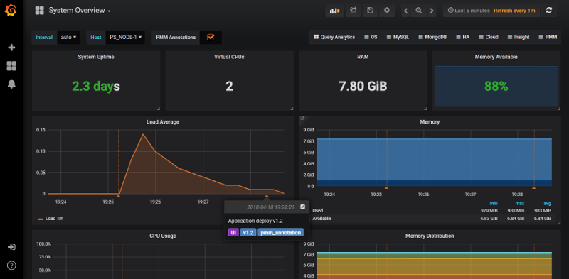
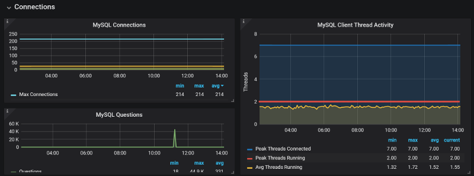

# Percona Monitoring and Management 1.10.0

* **Date**

    April 20, 2018

Percona announces the release of Percona Monitoring and Management 1.10.0.  Percona Monitoring and Management is a free and open-source platform for managing and monitoring MySQL and MongoDB performance.  You can run *PMM* in your own environment for maximum security and reliability. It provides thorough time-based analysis for MySQL and MongoDB servers to ensure that your data works as efficiently as possible. We focused mainly on two features in 1.10.0, but there are also several notable improvements worth highlighting:

* Annotations - Record and display application events as Annotations using **pmm-admin annotate**
* Grafana 5.0 - Improved visualization effects
* Switching between Dashboards - Now switching dashboards
* New PXC Galera Replication Latency Graphs - Added Galera Replication Latency graphs on PXC Overview dashboard with consistent colors

The Issues in this release includes 4 new features & improvements, and 8 bugs fixed.

## Annotations

Application events are one of the contributors to changes in database performance characteristics, and in this release PMM now supports receiving events and displaying them as Annotations using the new command **pmm-admin annotate**. A recent Percona survey reveals that database and DevOps engineers highly value visibility into the application layer.  By displaying application events on top of your PMM graphs, engineers can now correlate application events to database events (common cases: application deploys, outages, and upgrades) against Database and System level metric changes.



### Usage

For example, you have an application deployment that just completed to version 1.2, and it affects the UI only, so you want to set tags for the version and interface impacted:

```
$ pmm-admin annotate "Application deploy v1.2" --tags "UI, v1.2"
```

Using the optional `--tags` option allows you to filter which Annotations are displayed on the dashboard via a toggle option. Read more about Annotations utilization in the [PMM documentation](../pmm-admin.md#adding-annotations).

## Grafana 5.0

We’re extremely pleased to see Grafana ship 5.0 and we were fortunate enough to be at Grafanacon, including Percona’s very own [@Dimitri Vanoverbeke](https://www.percona.com/blog/author/dimitri-vanoverbeke/) (Dim0) who presented What we Learned Integrating Grafana and Prometheus!

<iframe width="560" height="315" src="https://www.youtube.com/embed/Mno1nYBmlIE" frameborder="0" allow="autoplay; encrypted-media" allowfullscreen></iframe>

<iframe width="560" height="315" src="https://www.youtube.com/embed/nYCE24DV8xA" frameborder="0" allow="autoplay; encrypted-media" allowfullscreen></iframe>

Included in Grafana 5.0 are a number of dramatic improvements, which in future PMM releases we plan to extend our usage of each feature, and the one we like best is the virtually unlimited way you can size and shape graphs.  No longer are you bound by panel constraints to keep all objects at the same fixed height! This improvement indirectly addresses the visualization error in PMM Server where some graphs would appear to be on two lines and ended up wasting screen space.



## Switching Between Dashboards

PMM now allows you to navigate between dashboards while maintaining the same host under observation, so that for example you can start on *MySQL Overview* looking at host serverA, switch to MySQL InnoDB Advanced dashboard and continue looking at serverA, thus saving you a few clicks in the interface.

## New PXC Galera Replication Latency Graphs

We have added new PXC Replication Latency graphs on our *PXC Galera Cluster Overview* dashboard so that you can compare latency across all members in a cluster in one view.


## Issues in this release

### New Features and Improvements

* [PMM-2293](https://jira.percona.com/browse/PMM-2293): Add the *Galera Replication Latency* graph to the *PXC/Galera Cluster overview* dashboard.
* [PMM-2295](https://jira.percona.com/browse/PMM-2295): Improve colour selection on the *PXC/Galera Cluster Overview* dashboard
* [PMM-2330](https://jira.percona.com/browse/PMM-2330): Application Annotations
* [PMM-2332](https://jira.percona.com/browse/PMM-2332): Grafana 5 update

### Bug fixes

* [PMM-2311](https://jira.percona.com/browse/PMM-2311): Fix mis-alignment in Query Analytics Metrics table
* [PMM-2341](https://jira.percona.com/browse/PMM-2341): Typo in text on password page of OVF
* [PMM-2359](https://jira.percona.com/browse/PMM-2359): Trim leading and trailing whitespaces for all fields on AWS/OVF Installation wizard
* [PMM-2360](https://jira.percona.com/browse/PMM-2360): Include a “What’s new?” link for Update widget
* [PMM-2346](https://jira.percona.com/browse/PMM-2346): Arithmetic on InnoDB AHI Graphs are invalid
* [PMM-2364](https://jira.percona.com/browse/PMM-2364): QPS are wrong in QAN
* [PMM-2388](https://jira.percona.com/browse/PMM-2388): Query Analytics does not render fingerprint section in some cases
* [PMM-2371](https://jira.percona.com/browse/PMM-2371): Pass host when switching between Dashboards
