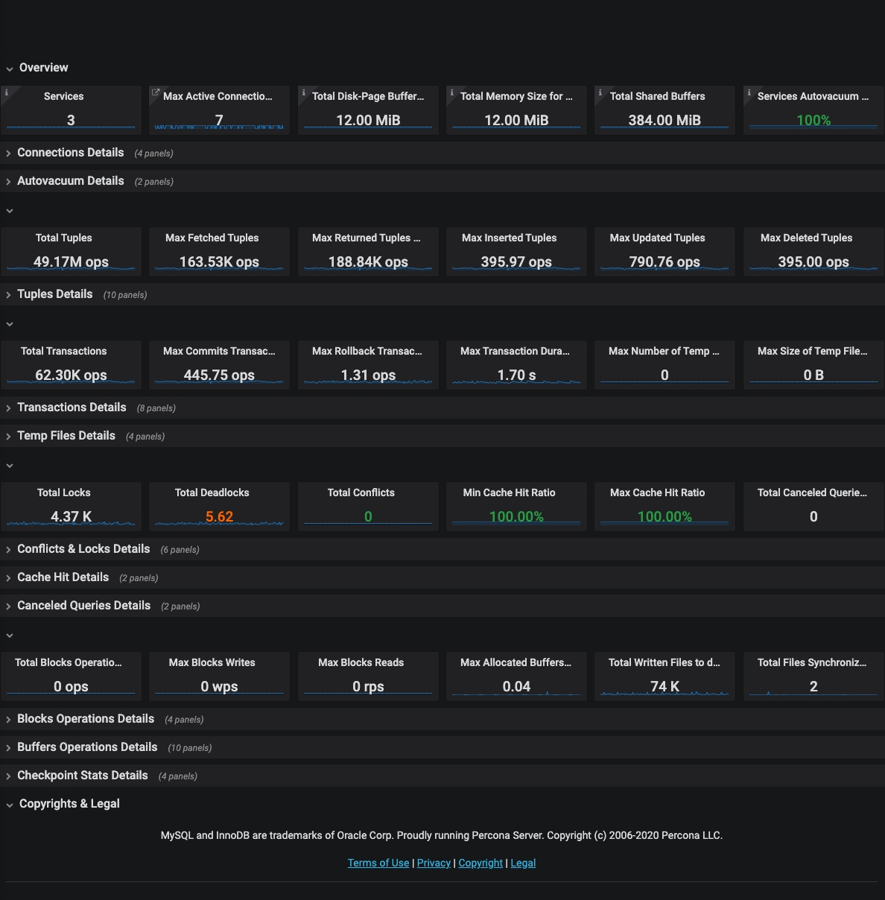

# PostgreSQL Instances Overview



## Connected

Reports whether PMM Server can connect to the PostgreSQL instance.

## Version

The version of the PostgreSQL instance.

## Shared Buffers

Defines the amount of memory the database server uses for shared memory buffers. Default is `128MB`. Guidance on tuning is `25%` of RAM, but generally doesn’t exceed `40%`.

## Disk-Page Buffers

The setting `wal_buffers` defines how much memory is used for caching the write-ahead log entries. Generally this value is small (`3%` of `shared_buffers` value), but it may need to be modified for heavily loaded servers.

## Memory Size for each Sort

The parameter `work_mem` defines the amount of memory assigned for internal sort operations and hash tables before writing to temporary disk files. The default is `4MB`.

## Disk Cache Size

PostgreSQL’s `effective_cache_size` variable tunes how much RAM you expect to be available for disk caching. Generally adding Linux free+cached will give you a good idea. This value is used by the query planner whether plans will fit in memory, and when defined too low, can lead to some plans rejecting certain indexes.

## Autovacuum

Whether autovacuum process is enabled or not. Generally the solution is to vacuum more often, not less.

## PostgreSQL Connections

Max Connections
:   The maximum number of client connections allowed. Change this value with care as there are some memory resources that are allocated on a per-client basis, so setting `max_connections` higher will generally increase overall PostgreSQL memory usage.

Connections
:   The number of connection attempts (successful or not) to the PostgreSQL server.

Active Connections
:   The number of open connections to the PostgreSQL server.

## PostgreSQL Tuples

Tuples
:   The total number of rows processed by PostgreSQL server: fetched, returned, inserted, updated, and deleted.

Read Tuple Activity
:   The number of rows read from the database: as returned so fetched ones.

Tuples Changed per 5min
:   The number of rows changed in the last 5 minutes: inserted, updated, and deleted ones.

## PostgreSQL Transactions

Transactions
:   The total number of transactions that have been either been committed or rolled back.

Duration of Transactions
:   Maximum duration in seconds any active transaction has been running.

## Temp Files

Number of Temp Files
:   The number of temporary files created by queries.

Size of Temp files
:   The total amount of data written to temporary files by queries in bytes.

!!! alert alert-info "Note"

    All temporary files are taken into account by these two gauges, regardless of why the temporary file was created (e.g., sorting or hashing), and regardless of the `log_temp_files` setting.

## Conflicts and Locks

Conflicts/Deadlocks
:   The number of queries canceled due to conflicts with recovery in the database (due to dropped tablespaces, lock timeouts, old snapshots, pinned buffers, or deadlocks).

Number of Locks
:   The number of deadlocks detected by PostgreSQL.

## Buffers and Blocks Operations

Operations with Blocks
:   The time spent reading and writing data file blocks by backends, in milliseconds.

!!! alert alert-info "Note"

    Capturing read and write time statistics is possible only if `track_io_timing` setting is enabled. This can be done either in configuration file or with the following query executed on the running system:

```sql
ALTER SYSTEM SET track_io_timing=ON;
SELECT pg_reload_conf();
```

Buffers
:   The number of buffers allocated by PostgreSQL.

## Canceled Queries

The number of queries that have been canceled due to dropped tablespaces, lock timeouts, old snapshots, pinned buffers, and deadlocks.

!!! alert alert-info "Note"

    Data shown by this gauge are based on the `pg_stat_database_conflicts` view.

## Cache Hit Ratio

The number of times disk blocks were found already in the buffer cache, so that a read was not necessary.

!!! alert alert-info "Note"
    This only includes hits in the PostgreSQL buffer cache, not the operating system’s file system cache.

## Checkpoint Stats

The total amount of time that has been spent in the portion of checkpoint processing where files are either written or synchronized to disk, in milliseconds.

## PostgreSQL Settings

The list of all settings of the PostgreSQL server.

## System Summary

This section contains the following system parameters of the PostgreSQL server: CPU Usage, CPU Saturation and Max Core Usage, Disk I/O Activity, and Network Traffic.
