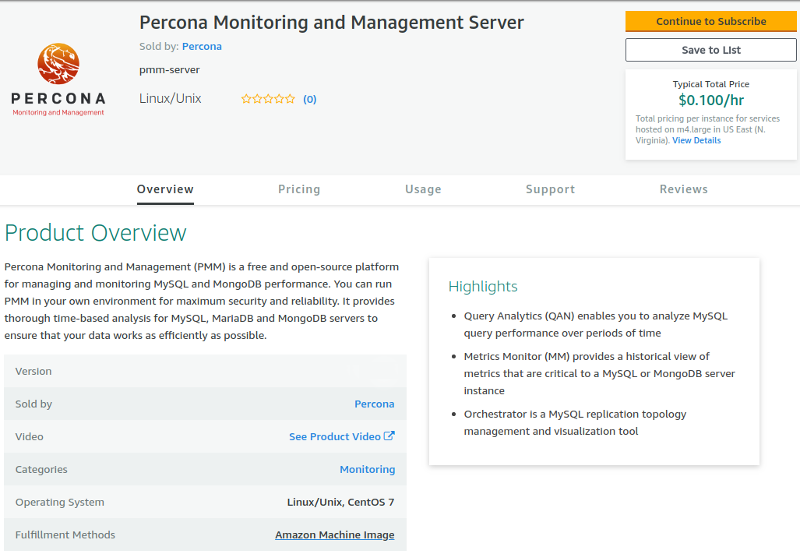
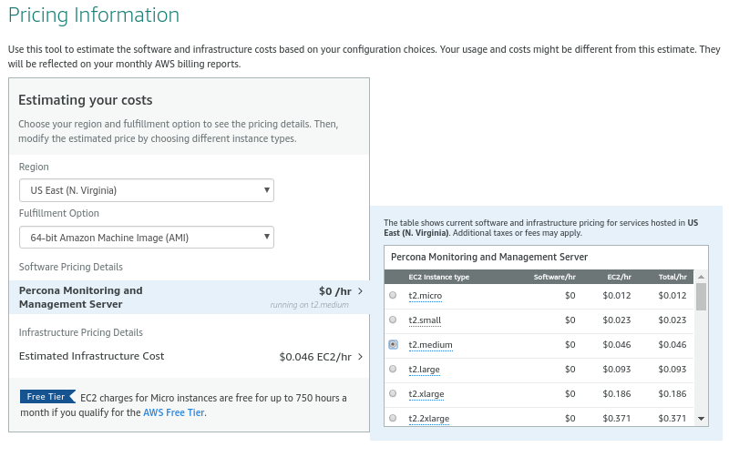
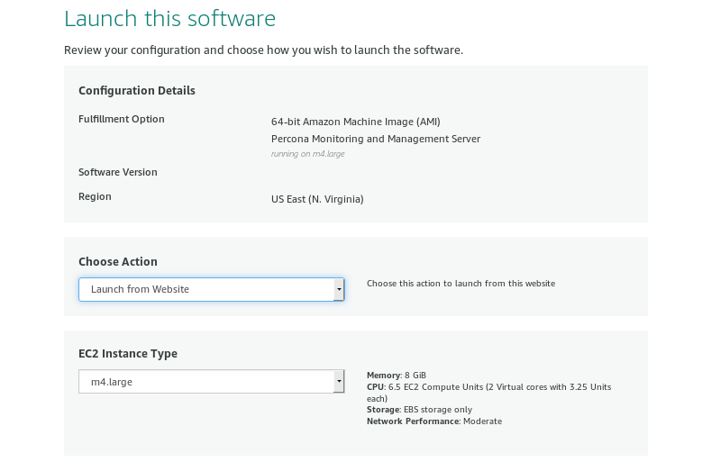
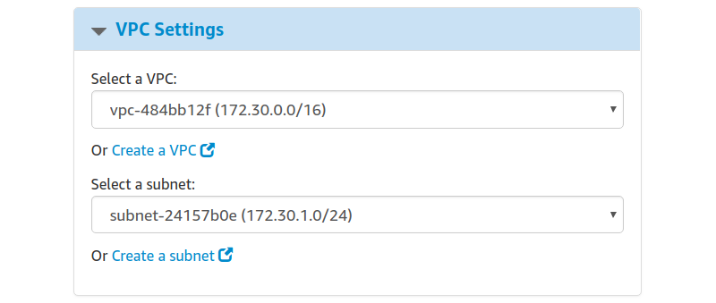
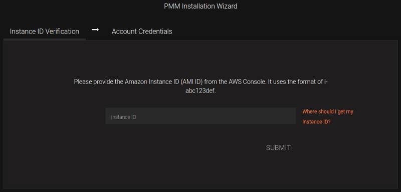
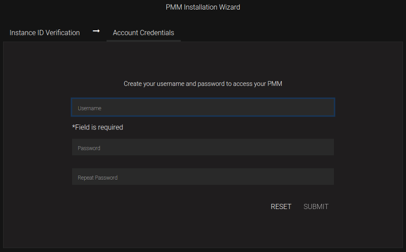

# Running PMM Server Using AWS Marketplace

You can run an instance of PMM Server hosted at AWS Marketplace. This method replaces the outdated method where you would have to accessing an AMI (Amazon Machine Image) by using its ID, different for each region.



*The home page of PMM in AWS Marketplace.*

Assuming that you have an AWS (Amazon Web Services) account, locate *Percona Monitoring and Management Server* in [AWS Marketplace](https://aws.amazon.com/marketplace/pp/B077J7FYGX).

The Pricing Information section allows to select your region and choose an instance type in the table that shows the pricing for the software and infrastructure hosted in the region you have selected (the recommended EC2 instance type is preselected for you). Note that actual choice will be done later, and this table serves the information purposes, to plan costs.



*As soon as you select your region, you can choose the EC2 instance in it and see its price. PMM comes for no cost, you may only need to pay for the infrastructure provided by Amazon.*

!!! alert alert-info "Note"
    Disk space consumed by PMM Server depends on the number of hosts under monitoring. Each environment will be unique, however consider modeling your data consumption based on [PMM Demo](https://pmmdemo.percona.com/) web site, which consumes ~230MB/host/day, or ~6.9GB/host at the default 30 day retention period. See [this blog post](https://www.percona.com/blog/2017/05/04/how-much-disk-space-should-i-allocate-for-percona-monitoring-and-management/) for more details.

Clicking the Continue to Subscribe button will proceed to the terms and conditions page. Clicking Continue to Configuration there will bring a new page to start setting up your instance.



*Percona Monitoring and Management on AWS Marketplace - launch options.*

Available launch options in the drop-down menu include *Launch from Website* and *Launch through EC2*. The first one is a quick way to make your instance ready. For more control, use the Manual Launch through EC2 option.

In this chapter

[TOC]

## Setting Up a PMM Instance Using the website GUI

Choose *Launch from Website* option, your region, and the EC2 instance type on the launch options page. On the previous screenshot, we use the `US East (N. Virginia)` region and the EC2 Instance Type named `m4.large`. To reduce cost, you need to choose the region closest to your location.

When all choices are done, click the *Continue to Launch* button to proceed.

### Setting up a VPC and an EC2 Instance Type

In this demonstration, we use the VPC (virtual private cloud) named `vpc-484bb12f`. The exact name of VPC may be different from the example discussed here.



*Select VPC in the VPC Settings section.*

Instead of a VPC (virtual private cloud) you may choose the `EC2 Classic (no VPC)` option and use a public cloud.

Selecting a subnet, you effectively choose an availability zone in the selected region. We recommend that you choose the availability zone where your RDS is located.

Note that the cost estimation is automatically updated based on your choice.

### Limiting Access to the instance: security group and a key pair

In the Security Group section, which acts like a firewall, you may use the preselected option `Create new based on seller settings` to create a security group with recommended settings. In the Key Pair select an already set up EC2 key pair to limit access to your instance.


*Select an already existing key pair (use the EC2 console to create one if necessary)*

!!! important
    It is important that the security group allow communication via the the following ports Ports: *22*, *80*, and *443*. PMM should also be able to access port *3306* on the RDS that uses the instance.


*Select a security group which manages firewall settings.*

### Applying settings

Scroll up to the top of the page to view your settings. Then, click the Launch with 1 click button to continue and adjust your settings in the **EC2 console**.


!!! alert alert-info "Note"
    The *Launch with 1 click* button may alternatively be titled as *Accept Software Terms & Launch with 1-Click*.

### Adjusting instance settings in the EC2 Console

Your clicking the Launch with 1 click button, deploys your instance. To continue setting up your instance, run the **EC2 console**. It is available as a link at the top of the page that opens after you click the Launch with 1 click button.

Your instance appears in the **EC2 console** in a table that lists all instances available to you. When a new instance is only created, it has no name. Make sure that you give it a name to distinguish from other instances managed via the **EC2 console**.


*The newly created instance selected.*

### Running the instance

After you add your new instance it will take some time to initialize it. When the AWS console reports that the instance is now in a running state, you many continue with configuration of PMM Server.

!!! alert alert-info "Note"
    When started the next time after rebooting, your instance may acquire another IP address. You may choose to set up an elastic IP to avoid this problem.

With your instance selected, open its IP address in a web browser. The IP address appears in the IPv4 Public IP column or as value of the Public IP field at the top of the Properties panel.


*The public IP address of the instance*

To run the instance, copy and paste its public IP address to the location bar of your browser. In the Percona Monitoring and Management welcome page that opens, enter the instance ID.



You can copy the instance ID from the Properties panel of your instance, select the Description tab back in the **EC2 console**. Click the Copy button next to the Instance ID field. This button appears as soon as you hover the cursor of your mouse over the ID.


*Hover the cursor over the instance ID for the Copy button to appear.*

Paste the instance in the Instance ID field of the Percona Monitoring and Management welcome page and click Submit.



Click Submit and enter your user name and password in the dialog window that pops up. The PMM Server is now ready and the home page opens.


You are creating a username and password that will be used for two purposes:

1. authentication as a user to PMM - this will be the credentials you need in order to log in to PMM.

2. authentication between PMM Server and PMM Clients - you will re-use these credentials when configuring pmm-client for the first time on a server, for example:

    Run this command as root or by using the **sudo** command

    ```
    $ pmm-admin config --username= --password= --server=1.2.3.4
    ```

!!! alert alert-info "Accessing the instance by using an SSH client"

    For instructions about how to access your instances by using an SSH client, see [Connecting to Your Linux Instance Using SSH](http://docs.aws.amazon.com/AWSEC2/latest/UserGuide/AccessingInstancesLinux.html)

    Make sure to replace the user name `ec2-user` used in this document with `admin`.

### Resizing the EBS Volume

Your instance comes with a predefined size which can become a limitation. To make more disk space available to your instance, you need to increase the size of the EBS volume as needed and then your instance will reconfigure itself to use the new size.

The procedure of resizing EBS volumes is described in the Amazon documentation: [Modifying the Size, IOPS, or Type of an EBS Volume on Linux](https://docs.aws.amazon.com/AWSEC2/latest/UserGuide/ebs-modify-volume.html).

After the EBS volume is updated, PMM Server instance will autodetect changes in approximately 5 minutes or less and will reconfigure itself for the updated conditions.

## Running PMM Server Using Amazon Machine Images

Percona provides public Amazon Machine Images (AMI) with PMM Server in all regions where Amazon Web Services (AWS) is available. You can launch an instance using the web console for the corresponding image:

| Region                    | String              | AMI ID |
| ------------------------- | ------------------- | ------ |
| Asia Pacific (Tokyo)      | **ap-northeast-1**  | [ami-0d7cd5d91dba7a337](https://console.aws.amazon.com/ec2/v2/home?region=us-east-1#Images:visibility=public-images;imageId=ami-0d7cd5d91dba7a337) |
| Asia Pacific (Seoul)      | **ap-northeast-2**  | [ami-0606a76833698d66b](https://console.aws.amazon.com/ec2/v2/home?region=us-east-1#Images:visibility=public-images;imageId=ami-0606a76833698d66b) |
| Asia Pacific (Mumbai)     | **ap-south-1**      | [ami-0a4b0afc6926b8625](https://console.aws.amazon.com/ec2/v2/home?region=us-east-1#Images:visibility=public-images;imageId=ami-0a4b0afc6926b8625) |
| Asia Pacific (Singapore)  | **ap-southeast-1**  | [ami-004ded7fa924ce4ec](https://console.aws.amazon.com/ec2/v2/home?region=us-east-1#Images:visibility=public-images;imageId=ami-004ded7fa924ce4ec) |
| Asia Pacific (Sydney)     | **ap-southeast-2**  | [ami-0a3f98b8b6c34a2e2](https://console.aws.amazon.com/ec2/v2/home?region=us-east-1#Images:visibility=public-images;imageId=ami-0a3f98b8b6c34a2e2) |
| Canada (Central)          | **ca-central-1**    | [ami-00b46791100d4c097](https://console.aws.amazon.com/ec2/v2/home?region=us-east-1#Images:visibility=public-images;imageId=ami-00b46791100d4c097) |
| EU (Frankfurt)            | **eu-central-1**    | [ami-0669bea2272632747](https://console.aws.amazon.com/ec2/v2/home?region=us-east-1#Images:visibility=public-images;imageId=ami-0669bea2272632747) |
| EU (Stockholm)            | **eu-north-1**      | [ami-01ae93772f26921ec](https://console.aws.amazon.com/ec2/v2/home?region=us-east-1#Images:visibility=public-images;imageId=ami-01ae93772f26921ec) |
| EU (Ireland)              | **eu-west-1**       | [ami-0ecd45316fe33441c](https://console.aws.amazon.com/ec2/v2/home?region=us-east-1#Images:visibility=public-images;imageId=ami-0ecd45316fe33441c) |
| EU (London)               | **eu-west-2**       | [ami-0edcc115190b77ed8](https://console.aws.amazon.com/ec2/v2/home?region=us-east-1#Images:visibility=public-images;imageId=ami-0edcc115190b77ed8) |
| EU (Paris)                | **eu-west-3**       | [ami-0640656f6400a870b](https://console.aws.amazon.com/ec2/v2/home?region=us-east-1#Images:visibility=public-images;imageId=ami-0640656f6400a870b) |
| South America (São Paulo) | **sa-east-1**       | [ami-07934243233049aa6](https://console.aws.amazon.com/ec2/v2/home?region=us-east-1#Images:visibility=public-images;imageId=ami-07934243233049aa6) |
| US East (N. Virginia)     | **us-east-1**       | [ami-05d0d72221501bdff](https://console.aws.amazon.com/ec2/v2/home?region=us-east-1#Images:visibility=public-images;imageId=ami-05d0d72221501bdff) |
| US East (Ohio)            | **us-east-2**       | [ami-0b8eb1cbcb6dfe2f2](https://console.aws.amazon.com/ec2/v2/home?region=us-east-1#Images:visibility=public-images;imageId=ami-0b8eb1cbcb6dfe2f2) |
| US West (N. California)   | **us-west-1**       | [ami-0178d5a07344e01e4](https://console.aws.amazon.com/ec2/v2/home?region=us-east-1#Images:visibility=public-images;imageId=ami-0178d5a07344e01e4) |
| US West (Oregon)          | **us-west-2**       | [ami-0b2b7fcd5341e75a9](https://console.aws.amazon.com/ec2/v2/home?region=us-east-1#Images:visibility=public-images;imageId=ami-0b2b7fcd5341e75a9) |

### Running from Command Line

1. Launch the PMM Server instance using the `run-instances` command for the corresponding region and image. For example:

    ```
    aws ec2 run-instances \
       --image-id ami-30ad0f4d \
       --security-group-ids sg-3b6e5e46 \
       --instance-type t2.micro \
       --subnet-id subnet-4765a930 \
       --region us-east-1 \
       --key-name SSH-KEYNAME
    ```

    !!! alert alert-info "Note"
        Providing the public SSH key is optional. Specify it if you want SSH access to PMM Server.

2. Set a name for the instance using the `create-tags` command. For example:

    ```
    aws ec2 create-tags  \
       --resources i-XXXX-INSTANCE-ID-XXXX \
       --region us-east-1 \
       --tags Key=Name,Value=OWNER_NAME-pmm
    ```

3. Get the IP address for accessing PMM Server from console output using the `get-console-output` command. For example:

    ```
    aws ec2 get-console-output \
       --instance-id i-XXXX-INSTANCE-ID-XXXX \
       --region us-east-1 \
       --output text \
       | grep cloud-init
    ```

## Upgrading PMM Server

### Upgrading EC2 instance class

Upgrading to a larger EC2 instance class is supported by PMM provided you follow the instructions from the [AWS manual](https://docs.aws.amazon.com/AWSEC2/latest/UserGuide/ec2-instance-resize.html). The PMM AMI image uses a distinct EBS volume for the PMM data volume which permits independent resize of the EC2 instance without impacting the EBS volume.

### Expanding the PMM Data EBS Volume

The PMM data volume is mounted as an XFS formatted volume on top of an LVM volume. There are two ways to increase this volume size:

1. Add a new disk via EC2 console or API, and expand the LVM volume to include the new disk volume.

2. Expand existing EBS volume and grow the LVM volume.

#### Expand existing EBS volume

To expand the existing EBS volume in order to increase capacity, the following steps should be followed.

1. Expand the disk from AWS Console/CLI to the desired capacity.

2. Login to the PMM EC2 instance and verify that the disk capacity has increased. For example, if you have expanded disk from 100G to 200G, `dmesg` output should look like below:

    ```
    [  535.994494] xvdb: detected capacity change from 107374182400 to 214748364800
    ```

3. You can check information about volume groups and logical volumes with the `vgs` and `lvs` commands:

    ```
    [root@ip-10-1-2-70 ~]# vgs
     VG     #PV #LV #SN Attr   VSize   VFree
     DataVG   1   2   0 wz--n- 100.00g 0

    [root@ip-10-1-2-70 ~]# lvs
     LV       VG     Attr       LSize   Pool Origin Data%  Meta% Move Log Cpy%Sync Convert
     DataLV   DataVG Vwi-aotz--  79.69g ThinPool     1.74
     ThinPool DataVG twi-aotz--  99.61g              1.39  0.43
    ```

4. Now we can use the `lsblk` command to see that our disk size has been identified by the kernel correctly, but LVM2 is not yet aware of the new size. We can use `pvresize` to make sure the PV device reflects the new size. Once `pvresize` is executed, we can see that the VG has the new free space available.

    ```
    [root@ip-10-1-2-70 ~]# lsblk | grep xvdb
     xvdb                      202:16 0 200G 0 disk

    [root@ip-10-1-2-70 ~]# pvscan
     PV /dev/xvdb   VG DataVG    lvm2 [<16.00 GiB / 0    free]
     Total: 1 [100.00 GiB] / in use: 1 [100.00 GiB] / in no VG: 0 [0   ]

    [root@ip-10-1-2-70 ~]# pvresize /dev/xvdb
     Physical volume "/dev/xvdb" changed
     1 physical volume(s) resized / 0 physical volume(s) not resized

    [root@ip-10-1-2-70 ~]# pvs
     PV         VG     Fmt  Attr PSize   PFree
     /dev/xvdb  DataVG lvm2 a--  199.30g 99.30g
    ```

5. We then extend our logical volume. Since the PMM image uses thin provisioning, we need to extend both the pool and the volume:

    ```
    [root@ip-10-1-2-70 ~]# lvs
     LV       VG     Attr       LSize   Pool     Origin Data%  Meta% Move Log Cpy%Sync Convert
     DataLV   DataVG Vwi-aotz--  79.69g ThinPool        1.77
     ThinPool DataVG twi-aotz--  99.61g                 1.42   0.43

    [root@ip-10-1-2-70 ~]# lvextend /dev/mapper/DataVG-ThinPool -l 100%VG
     Size of logical volume DataVG/ThinPool_tdata changed from 99.61 GiB (25499 extents) to 198.91 GiB (50921 extents).
     Logical volume DataVG/ThinPool_tdata successfully resized.

    [root@ip-10-1-2-70 ~]# lvs
     LV       VG     Attr       LSize   Pool     Origin Data%  Meta% Move Log Cpy%Sync Convert
     DataLV   DataVG Vwi-aotz--  79.69g ThinPool        1.77
     ThinPool DataVG twi-aotz-- 198.91g                 0.71   0.83
    ```

6. Once the pool and volumes have been extended, we need to now extend the thin volume to consume the newly available space. In this example we’ve grown available space to almost 200GB, and already consumed logical volume size, so we’re extending an additional 119GB:

    ```
    [root@ip-10-1-2-70 ~]# lvs
     LV       VG     Attr       LSize   Pool     Origin Data%  Meta% Move Log Cpy%Sync Convert
     DataLV   DataVG Vwi-aotz--  79.69g ThinPool        1.77
     ThinPool DataVG twi-aotz-- 198.91g                 0.71   0.83

    [root@ip-10-1-2-70 ~]# lvextend /dev/mapper/DataVG-DataLV -L +119G
     Size of logical volume DataVG/DataLV changed from 79.69 GiB (20401 extents) to 198.91 GiB (50865 extents).
     Logical volume DataVG/DataLV successfully resized.

    [root@ip-10-1-2-70 ~]# lvs
     LV       VG     Attr       LSize   Pool    Origin Data%  Meta% Move Log Cpy%Sync Convert
     DataLV   DataVG Vwi-aotz-- 198.69g ThinPool        0.71
     ThinPool DataVG twi-aotz-- 198.91g                 0.71   0.83
    ```

7. We then expand the XFS filesystem to reflect the new size using `xfs_growfs`, and confirm the filesystem is accurate using the `df` command.

    ```
    [root@ip-10-1-2-70 ~]# df -h /srv
    Filesystem                  Size Used Avail Use% Mounted on
    /dev/mapper/DataVG-DataLV   100G 249M  100G   0% /srv

    [root@ip-10-1-2-70 ~]# xfs_growfs /srv
    meta-data=/dev/mapper/DataVG-DataLV isize=512    agcount=103, agsize=1305648 blks
             =                          sectsz=512   attr=2, projid32bit=1
             =                          crc=1        finobt=0 spinodes=0
    data     =                          bsize=4096   blocks=20890368, imaxpct=25
             =                          sunit=16     swidth=16 blks
    naming   =version 2                 bsize=4096   ascii-ci=0 ftype=1
    log      =internal                  bsize=4096   blocks=10208, version=2
             =                          sectsz=512   sunit=16 blks, lazy-count=1
    realtime =none                      extsz=4096   blocks=0, rtextents=0
    data blocks changed from 20890368 to 52085760

    [root@ip-10-1-2-70 ~]# df -h /srv
    Filesystem                 Size Used Avail Use% Mounted on
    /dev/mapper/DataVG-DataLV   32G 254M   32G   1% /srv
    ```
