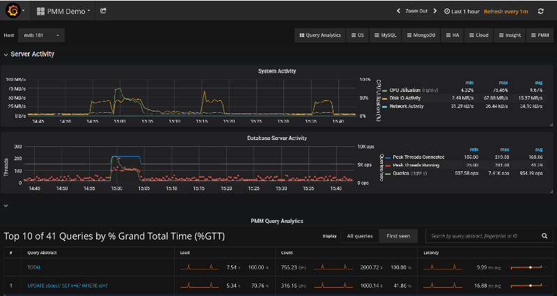
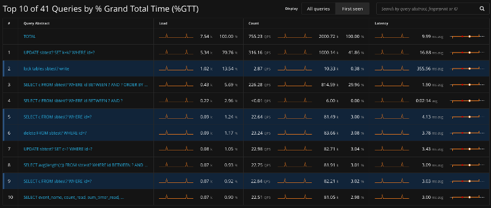
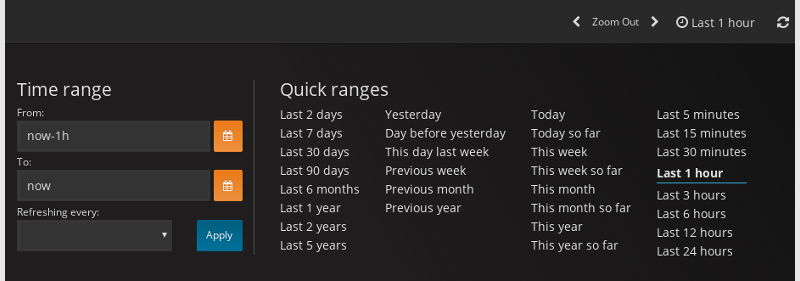
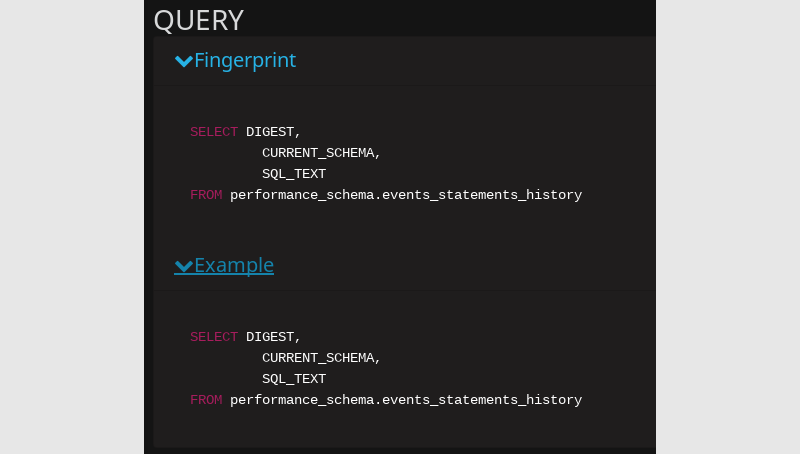
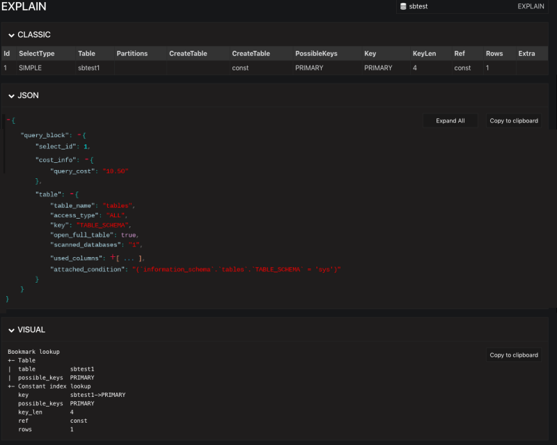
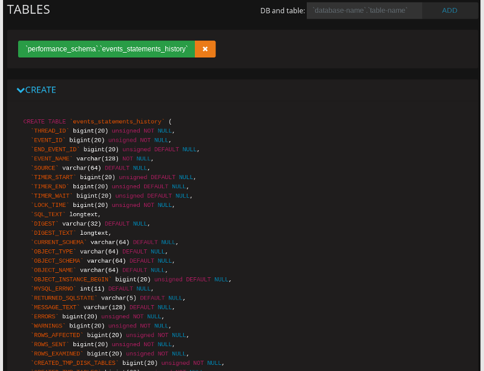
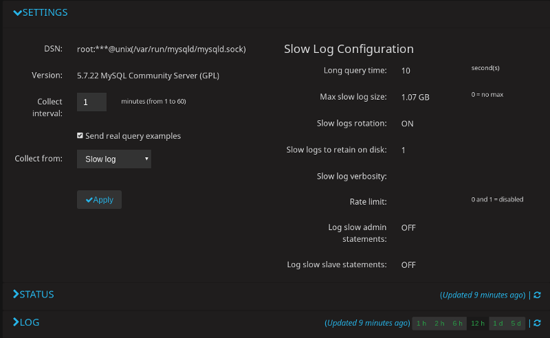
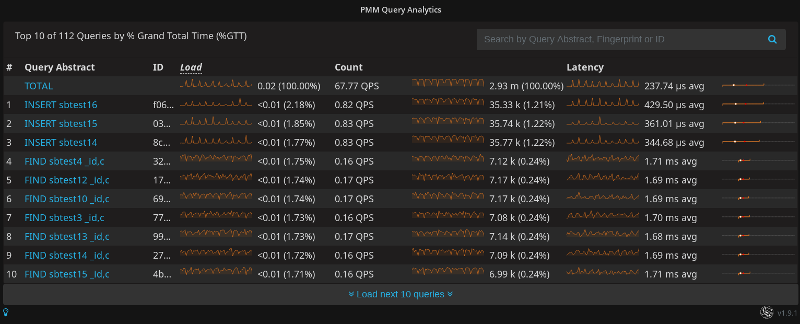
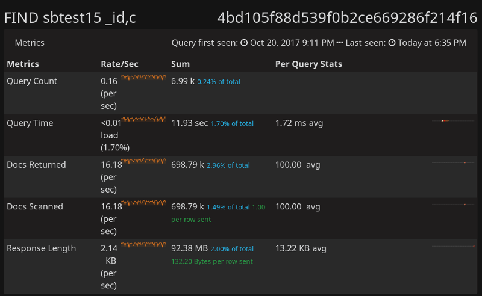

# PMM Query Analytics

!!! alert alert-warning "Warning"
    You are viewing documentation for PMM {{release}}.

    For the latest, see [PMM 2.x documentation]({{PMM2DOCROOT}}query-analytics.html)

The QAN is a special dashboard which enables database administrators and application developers to analyze database queries over periods of time and find performance problems. QAN helps you optimize database performance by making sure that queries are executed as expected and within the shortest time possible.  In case of problems, you can see which queries may be the cause and get detailed metrics for them.

*QAN helps analyze database queries over periods of time and find performance problems.*

!!! alert alert-info "Important"
    PMM Query Analytics supports MySQL and MongoDB. The minimum requirements for MySQL are:

    * MySQL 5.1 or later (if using the slow query log)
    * MySQL 5.6.9 or later (if using Performance Schema)

QAN displays its metrics in both visual and numeric form: the performance related characteristics appear as plotted graphics with summaries.

In this section

[TOC]

## Opening QAN from the PMM Home Page

To start working with QAN, open the list of dashboards on the PMM home page. Then, proceed to the Host field at the top of the page and select a host where the PMM Client is installed from the list of database instances.

The QAN dashboard will show a summary of the selected host and database activity metrics followed by the list of queries in a summary table. By default, QAN shows the top *ten* queries ranked by %GTT (Grand total time). Each query displays three essential metrics: *Load*, *Count*, and *Latency*. Also queries which are newly seen within the the time range selected are highlighted with a blue color for quicker identification.

Also it worth to mention that QAN data come in with typical 1-2 min delay, though it is possible to be delayed more because of specific network condition and state of the monitored object. In such situations QAN reports “no data” situation, using sparkline to and showing a gap in place of the time interval, for which data are not available yet.

*Showing intervals for which data are unavailable yet.*

To view more queries, click the Load next 10 queries button below the query summary table.

*The query summary table shows the monitored queries from the selected database.*

## Filtering Queries

If you need to limit the list of available queries to only those that you are interested in, use the Query Filter field located above the query summary table.

In the Query Filter field, you can enter a query ID, query abstract, or query fingerprint.  The ID is a unique signature of a query and looks like a long hexadecimal number. Note that each query in the summary table displays its ID in the *ID* column.

The query fingerprint is a simplified form of a query: all specific values are replaced with placeholders. You may enter only a fragment of the fingerprint to view all queries that contain that fragment in their fingerprints.

The query abstract is the portion of the query fingerprint which contains the type of the query, such as *SELECT* or *FIND*, and the attributes from the projection (a set of requested columns in case of MySQL database, for example).

When you apply a filter, the query summary table changes to display only the queries which match your criterion. Note that the TOTAL row which runs above the list of queries in the summary table does not change its values. These are always calculated based on all queries run within the selected time or date range.

*A list of queries*

### Selecting Time or Date Range

The query metrics that appear in QAN are computed based on a time period or a range of dates. The default value is *the last hour*. To set another range use the *range selection tool* located at the top of the QAN page.

*QAN displays query metrics for the time period or date range that you specify.*

The tool consists of two parts. The *Quick ranges* offers frequently used time ranges. The date picker sets a range of dates.

### Totals of the Query Summary

The first line of the query summary contains the totals of the *load*, *count*, and *latency* for all queries that were run on the selected database server during the time period that you’ve specified.

*The totals appear at the top of the query summary table.*

The *load* is the amount of time that the database server spent during the selected time or date range running all queries.

The *count* is the average number of requests to the server during the specified time or date range.

The *latency* is the average amount of time that it took the database server to retrieve and return the data.

### Queries in the Query Summary Table

Each row in the query summary contains information about a single query. Each column is query attribute. The *Abstract* attribute is an essential part of the fingerprint which informs the type of query, such as INSERT, or UPDATE, and the queried tables, or collections. The *ID* attribute is a unique hexadecimal number associated with the given query.

The *Load*, *Count*, and *Latency* attributes refer to the essential metrics of each query. Their values are plotted graphics and summary values in the numeric form. The summary values have two parts. The average value of the metric and its percentage with respect to the corresponding total value at the top of the query summary table.

### Viewing a Specific Value of a Metric

If you hover the cursor over one of the metrics in a query, you can see a concrete value at the point where your cursor is located. Move the cursor along the plotted line to watch how the value is changing.

*Hover the cursor to see a value at the point.*

## Zooming into a Query

Click one of the queries to zoom it in. QAN displays detailed information about the query in the Query Metrics Summary Table below the Query Summary Table. The detailed information includes the query type specific metrics. It also contains details about the database and tables which are used in the query.

*Select a query from the query summary table to open its metrics.*

### Query Section

In addition to the metrics in the Query Metrics Summary Table, **QAN** displays more information about the query itself. The `Query` section contains the fingerprint and an example of the query.

*The Query section shows the SQL statement for the selected query.*

### Explain Section

The Explain section enables you to run **EXPLAIN** on the selected query directly from the PMM web interface (simply specify the database).

The output appears in three forms: classic, JSON and visual. The classic form presents the attributes of the **EXPLAIN** command as columns of a table. The JSON format presents the output of **EXPLAIN** as a JSON document. To help you better understand how the query has been optimized, the visual form shows how the query accesses the tables it includes. The output of the visual form is identical to that of **pt-visual-explain**.

!!! alert alert-info "Note"
    The Copy to clipboard button available in Explain, Fingerprint, Example, and Tables sections is useful to save the output and pass it to external tools, such as **pt-visual-explain**.

*The three output formats of the EXPLAIN command.*

Note that the **EXPLAIN** command only works with the following statements:

* **SELECT**
* **DELETE**
* **INSERT**
* **REPLACE**
* **UPDATE**

If you are viewing the details of a query of another type, the Explain section will not contain any data.

!!! alert alert-info "Related information"
    pt-visual-explain: a tool to show the query plan based on the output of the EXPLAIN command <https://www.percona.com/doc/percona-toolkit/LATEST/pt-visual-explain.html>

### Table Info Section

At the bottom, you can run Table Info for the selected query.  This enables you to get `SHOW CREATE TABLE`, `SHOW INDEX`, and `SHOW TABLE STATUS` for each table used by the query directly from the PMM
web interface.

## Configuring QAN

All *PMM Query Analytics* settings are available from the *Query Analytics Settings* dashboard. To open this dashboard, use the PMM menu group.

### Settings Tab

The Settings tab displays the essential configuration settings of the database server selected from the Databases list. From this tab you can see which DSN is being used as well as the database server version.

This tab contains several settings which influence how the monitored data are collected. Note that these settings cannot be changed directly in QAN. You need to set the appropriate options by using the tools from the database server itself. You can, however, select where the database server metrics are collected from, such as *slow log*, or *Performance Schema*. For this, change the value of the Collect from field accordingly.

When you choose to collect MySQL data from *slow log*, a group of read only values becomes available. Note that these settings cannot be set in PMM directly. These are essential parameters of MySQL that affect the operation of *slow log*. If you need to change these settings refer to the appropriate sections of MySQL documentation.

### Status Tab

The Status tab contains detailed information about the current status of the monitored database server. QAN collects this information from the database server directly. For example, in case of a MySQL server, the **SHOW STATUS** command is used.

### Log Tab

The Log tab contains the latest version of the monitored log, such as *slow log*. At the top of this tab, you may notice when exactly the snapshot was taken.

## QAN for MongoDB

MongoDB is conceptually different from relational database management systems, such as MySQL or MariaDB. Relational database management systems store data in tables that represent single entities. In order to represent complex objects you may need to link records from multiple tables. MongoDB, on the other hand, uses the concept of a document where all essential information pertaining to a complex object is stored together.

QAN supports monitoring MongoDB queries. Although MongoDB is not a relational database management system, you analyze its databases and collections in the same interface using the same tools. By using the familiar and intuitive interface of QAN you can analyze the efficiency of your application reading and writing data in the collections of your MongoDB databases.

*Analyze MongoDB queries using the same tools as relational database management systems.*
