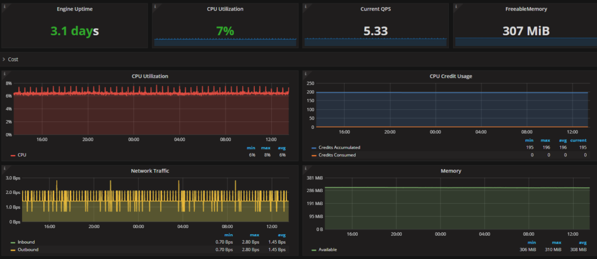
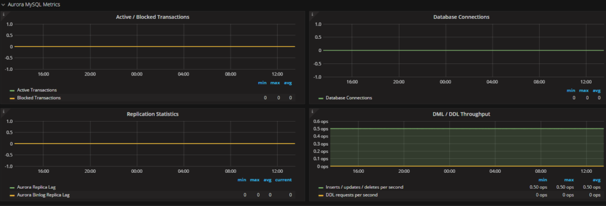
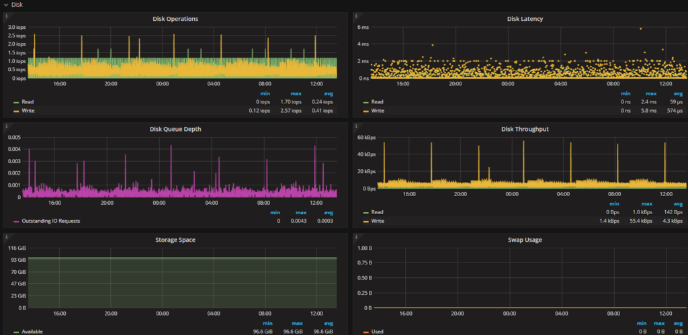

# Percona Monitoring and Management 1.5.0

* **Date**

    November 23, 2017

Percona announces the release of Percona Monitoring and Management 1.5.0, with a focus on the following features:

* Enhanced support for MySQL on Amazon RDS and Amazon Aurora – Dedicated Amazon Aurora dashboard offers maximum visibility into key database characteristics, eliminating the need for additional monitoring nodes.  We renamed Amazon RDS OS Metrics to Amazon RDS / Amazon MySQL Metrics
* Simpler configuration – Percona Monitoring and Management now offers easier configuration of key Amazon RDS and Amazon Aurora settings via a web interface
* One-click data collection – One button retrieves vital information on server performance to assist with troubleshooting
* Improved interface – A simple, consistent user interface makes it faster and more fluid to switch between *PMM Query Analytics* and Metrics Monitor

*Highlights from our new Amazon RDS / Aurora MySQL Metrics dashboard:*

**Amazon Aurora MySQL & RDS MySQL  shared elements**

**Amazon Aurora MySQL unique elements**

**Amazon RDS for MySQL unique elements**

QAN is now integrated into Metrics Monitor and appears as a separate dashboard known as PMM.

With this release, Percona Monitoring and Management introduces a new deployment option via AWS Marketplace.  This is in addition to our distribution method of [Amazon Machine Images (AMI)](../deploy/server/ami.md).

In this release, Grafana and Prometheus have been upgraded. PMM now includes Grafana 4.6.1. One of the most prominent features that the upgraded Grafana offers is the support of annotations. You can mark a point or select a region in a graph and give it a meaningful description. For more information, see the [release highlights](http://docs.grafana.org/guides/whats-new-in-v4-6/).

Prometheus version 1.8.2, shipped with this release, offers a number of bug fixes. For more information, see the [Prometheus change log](https://github.com/prometheus/prometheus/blob/master/CHANGELOG.md#182--2017-11-04).

## New features

* [PMM-434](https://jira.percona.com/browse/PMM-434): PMM enables monitoring of Amazon RDS and Amazon Aurora metrics
* [PMM-1133](https://jira.percona.com/browse/PMM-1133): *PMM Query Analytics* is available from Grafana as a dashboard
* [PMM-1470](https://jira.percona.com/browse/PMM-1470): Cloudwatch metrics have been integrated into Prometheus
* [PMM-699](https://jira.percona.com/browse/PMM-699): AWS RDS and Amazon Aurora metrics were combined into one dashboard
* [PMM-722](https://jira.percona.com/browse/PMM-722): The MariaDB dashboard graph elements were distributed among other existing dashboards and MariaDB dashboard was removed; further the MyISAM dashboard was renamed to MyISAM/Aria Metrics
* [PMM-1258](https://jira.percona.com/browse/PMM-1258): The DISABLE_UPDATES option enables preventing manual updates when PMM Server is run from a Docker container.
* [PMM-1500](https://jira.percona.com/browse/PMM-1500): Added InnoDB Buffer Disk Reads to graph InnoDB Buffer Pool Requests to better understand missed InnoDB BP cache hits

## Improvements

* [PMM-1577](https://jira.percona.com/browse/PMM-1577): Prometheus was updated to version 1.8.2
* [PMM-1603](https://jira.percona.com/browse/PMM-1603): Grafana was updated to version 4.6.1
* [PMM-1669](https://jira.percona.com/browse/PMM-1669): The representation of numeric values in the Context Switches graph in the System Overview dashboard was changed to improve readability.
* [PMM-1575](https://jira.percona.com/browse/PMM-1575): Templating rules were improved for the MyRocks and TokuDB dashboards so that only those instances with these storage engines are displayed.

## Bug fixes

* [PMM-1082](https://jira.percona.com/browse/PMM-1082): The CPU Usage graph on the Trends dashboard showed incorrect spikes
* [PMM-1549](https://jira.percona.com/browse/PMM-1549): The authentication of the mongodb:queries monitoring service did not work properly when the name of the database to authenticate was not provided.
* [PMM-1673](https://jira.percona.com/browse/PMM-1673): Fixed display issue with Microsoft Internet Explorer 11
